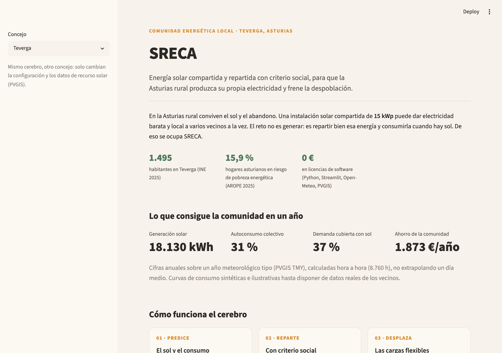
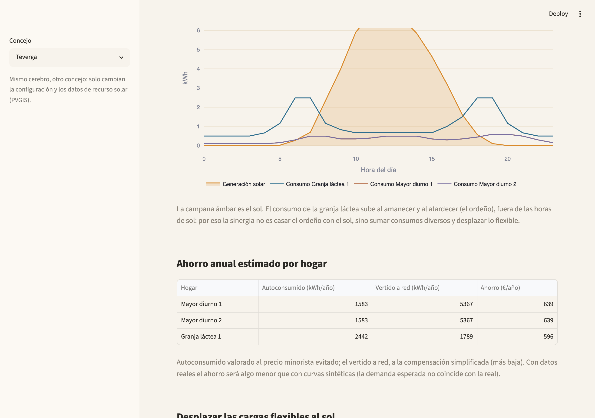

# SRECA — Sistema Rural de Energía Comunitaria Asturiana

Cerebro software de una **Comunidad Energética Local** en la Asturias rural (piloto Teverga):
autoconsumo colectivo FV 15 kWp gestionado por analítica predictiva. Optimiza el reparto de la
energía solar entre vecinos y desplaza cargas flexibles a las horas de sol — sin baterías
("batería virtual" = gestión del momento de consumo).

**Stack coste-licencia 0 €:** Python + Streamlit + Open-Meteo (API gratuita) + SQLite.

## Vista





## Estado

MVP funcional, presentable. Slice vertical completo extremo a extremo (PVGIS → forecast →
optimizador → SQLite → dashboard), 76 tests, dashboard verificado headless. Demografía de los
concejos verificada en fuente (INE, padrón 2025) y precios PVPC 2026 conservadores — ver
`docs/2026-06-22-official-data-sources.md`. Datos de consumo sintéticos (ilustrativos) hasta
disponer de curvas reales de los vecinos. Despliegue público (Streamlit Cloud) pendiente de
configurar la app en share.streamlit.io.

## Cómo funciona (MVP)

```
Open-Meteo → forecast FV (modelo físico) + forecast demanda (perfiles sintéticos)
          → optimizador (coeficientes ex-ante + recomendación desplazamiento de carga)
          → SQLite → dashboard Streamlit (producción · coeficientes · ahorro €/hogar)
```

Dos salidas legales distintas (norma vigente 2026):
- **Perfil ex-ante anual** de coeficientes de reparto (revisable ≥4 meses, Orden TED/1247/2021).
- **Recomendación de desplazamiento** de cargas flexibles de granja → ventana solar (siempre legal).

## Estructura

```
config/concejos/   # parámetros por concejo (teverga.yaml). Replicar = añadir YAML
sreca/ingest/      # cliente Open-Meteo
sreca/forecast/    # producción FV (físico) + demanda (sintética)
sreca/optimize/    # coeficientes + schedule ex-ante + load-shift + savings
sreca/store/       # SQLite
sreca/dashboard/   # Streamlit
tests/             # TDD
docs/              # spec de diseño + verificación legal 2026
```

## Docs

- Spec de diseño: `docs/2026-06-19-sreca-mvp-design.md`
- Verificación legal 2026: `docs/2026-06-19-legal-verification-2026.md`
- Fuentes de datos oficiales (INE, PVPC, Caja Rural): `docs/2026-06-22-official-data-sources.md`
- Memoria de beca e investigación de partida: documento interno (no incluido en el repo).

## Setup

```bash
python -m venv .venv && source .venv/bin/activate
pip install -r requirements.txt        # solo runtime (app)
streamlit run streamlit_app.py         # la base de datos se autogenera al primer arranque
```

Para desarrollo y tests:

```bash
pip install -r requirements-dev.txt
playwright install chromium            # solo para la captura headless (scripts/shoot.py)
pytest
```

### Despliegue (Streamlit Community Cloud)

Repositorio: <https://github.com/pmiguelgprado-hub/sreca> (público). `streamlit_app.py` es el
punto de entrada. El repositorio no incluye base de datos (`.sqlite` está en `.gitignore` por
privacidad); la app la regenera sola al cargar.

Para publicar el enlace (un solo paso, requiere tu cuenta de GitHub):

1. Entra en <https://share.streamlit.io> con GitHub.
2. New app → repo `pmiguelgprado-hub/sreca`, rama `main`, archivo `streamlit_app.py`.
   Enlace directo con el formulario relleno:
   <https://share.streamlit.io/deploy?repository=pmiguelgprado-hub/sreca&branch=main&mainModule=streamlit_app.py>
3. Deploy. Streamlit instala `requirements.txt` (rangos verificados en Python 3.13) y queda
   una URL pública con datos sintéticos.

## Contexto

Propuesta para la **convocatoria de innovación (máster) de la Fundación Caja Rural de Asturias**
— desarrollar un proyecto que ayude a la Asturias rural (cierre 31 de julio de 2026). Proyecto de
desarrollo rural que usa la energía como herramienta. Replicable a otros concejos en riesgo de
despoblación (Somiedo, Ponga, Allande, Ibias, Degaña, Quirós…) añadiendo su configuración y sus
datos de recurso solar (PVGIS TMY, gratis); el software no cambia.
